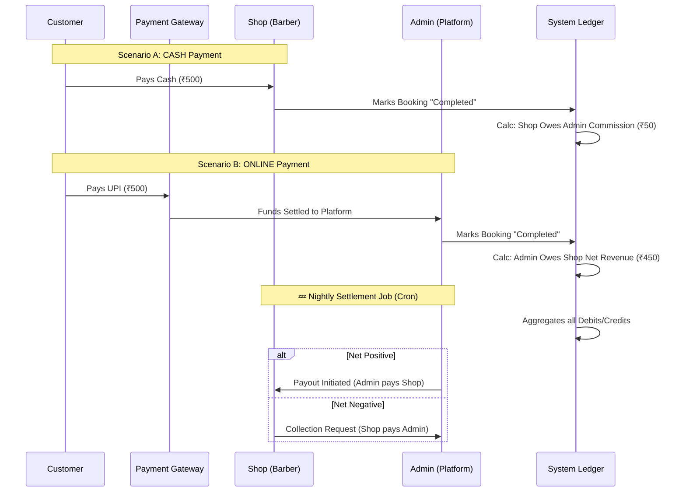
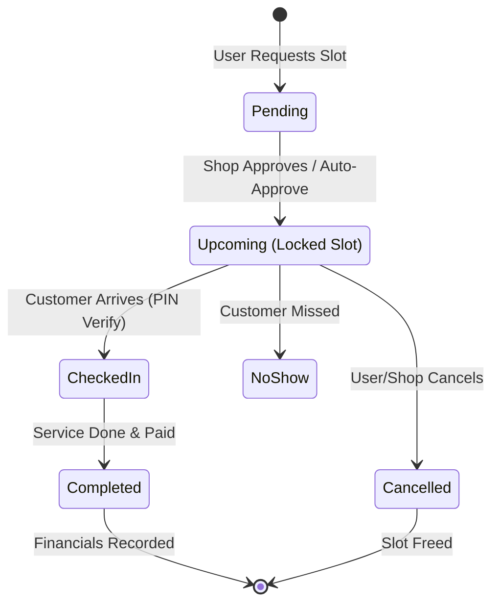

# 🚀 Project Pitch: "HairOne" - The Uber for Salons

**Empowering Local Barbers, Simplifying Personal Care.**

---

## 1. Executive Summary
HairOne is a hyper-local marketplace connecting customers with nearby salons and independent barbers. Unlike generic booking tools, HairOne handles the **entire lifecycle**: from geospatial discovery and real-time slot availability to split-payments and automated financial reconciliation.

**Value Proposition:**
*   **For Customers:** "Book a haircut in 3 taps." No phone calls, no waiting.
*   **For Shops:** A complete "Business in a Box" (Scheduling, CRM, Finance, Portfolio).
*   **For Admin (Platform):** A scalable, commission-based revenue model with automated settlements.

---

## 2. High-Level System Architecture

This system is built for **scale** and **cross-platform** availability (iOS, Android, Web).

```mermaid
graph TD
    %% Nodes
    UserApp[📱 Customer App\n(React Native)]
    ShopApp[💼 Business Dashboard\n(React Native / Web)]
    AdminPanel[🛡️ Admin Console\n(Web)]

    API[⚙️ Backend API\n(Node.js / Express)]
    DB[(🍃 MongoDB Atlas\nTransactions & Geo-Spatial)]

    S3[☁️ DigitalOcean Spaces\n(Image Storage)]
    Cron[⏰ Settlement Cron Job\n(Automated Finance)]

    %% Flows
    UserApp -->|JSON / HTTPS| API
    ShopApp -->|JSON / HTTPS| API
    AdminPanel -->|JSON / HTTPS| API

    API -->|Read/Write| DB
    API -->|Uploads| S3
    Cron -->|Daily Reconciliation| DB

    %% Styling
    style API fill:#f9f,stroke:#333,stroke-width:2px
    style DB fill:#bbf,stroke:#333,stroke-width:2px
    style Cron fill:#f96,stroke:#333,stroke-width:2px
```

---

## 3. The Revenue Engine (Money Flow)

Our competitive advantage is the **Automated Split-Settlement System**. We handle mixed payment methods (Cash vs. Online) seamlessly.



---

## 4. The Booking Lifecycle

We solve the problem of "No-Shows" and "Double Bookings" using a robust state machine with **PIN Verification**.



---

## 5. Technology Stack Highlights

| Layer | Technology | Why we chose it? |
| :--- | :--- | :--- |
| **Frontend** | **React Native (Expo)** | One codebase for iOS, Android, and Web. Fast iteration. |
| **Backend** | **Node.js + Express** | High concurrency, shared types with frontend, massive ecosystem. |
| **Database** | **MongoDB** | Geospatial queries (`$nearSphere`) and Aggregation Pipelines for analytics. |
| **Storage** | **AWS S3 / DigitalOcean** | Scalable, cheap storage for shop galleries and user avatars. |
| **Infrastructure** | **Cron + Docker** | Automated background jobs ensure financials are never wrong. |

---

## 6. Scalability & Roadmap

### Current Capabilities
*   **Geospatial Search:** "Find barbers within 5km".
*   **Role-Based Access Control:** Secure JWT middleware protecting Admin vs. Owner vs. User routes.
*   **Atomic Transactions:** Financial data is ACID compliant using MongoDB Transactions.

### Growth Roadmap
1.  **Inventory Management:** Allow shops to sell products (Gel, Wax) alongside services.
2.  **Loyalty Program:** "Buy 10 haircuts, get 1 free" tracked automatically.
3.  **Staff Management:** Granular permissions for individual barbers within a shop.
4.  **AI Recommendations:** Suggest services based on booking history ("Time for a trim?").

---
